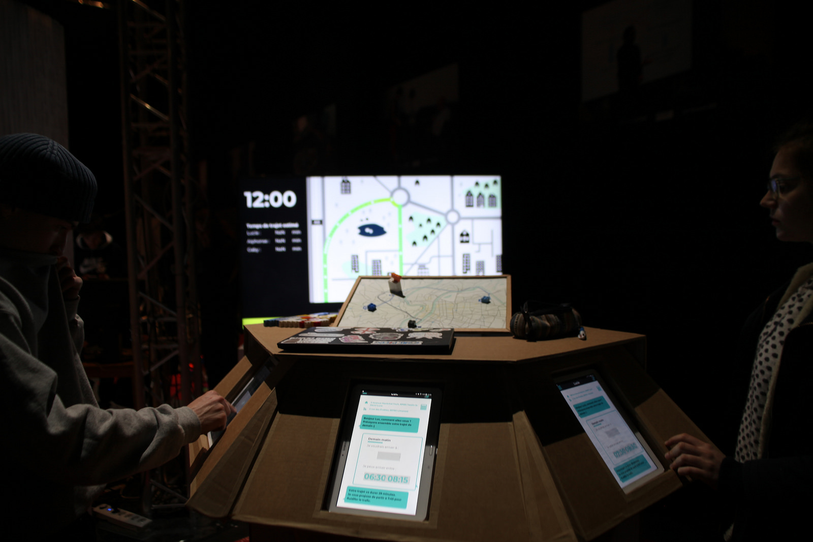

# 🚗 FLUX



> [🇬🇧 English Documentation Here](README_EN.md)

Il s'agit d'un prototype d'application mobile qui permet aux utilisateurs de décaler leurs horaires d'arrivée au travail pour réduire la congestion du trafic et optimiser leur temps de trajet.
[En savoir plus](https://www.erasme.org/InterCitoyen).

## Table des matières
- [🚗 FLUX](#-flux)
	- [Table des matières](#table-des-matières)
	- [🗒 Prérequis](#-prérequis)
	- [🚀 Démarrage rapide](#-démarrage-rapide)
	- [⚙️ Installation](#️-installation)
	- [Docker compose](#docker-compose)
		- [Installation manuelle](#installation-manuelle)
	- [🖋 Notes de l'auteurice](#-notes-de-lauteurice)
		- [Description globale](#description-globale)
			- [Aperçu](#aperçu)
			- [Architecture physique](#architecture-physique)
			- [Implémentation et structure](#implémentation-et-structure)
		- [Guide d'utilisation](#guide-dutilisation)
		- [En cas de problème](#en-cas-de-problème)
		- [Modification des paramètres de la démo](#modification-des-paramètres-de-la-démo)
	- [Encore à faire:](#encore-à-faire)


## 🗒 Prérequis

**Si installation manuelle:**
- [NodeJS](https://nodejs.org/en/)
- [npm](https://www.npmjs.com/)
- 
**Si installation via Docker:**
- [Docker](https://www.docker.com/)


## 🚀 Démarrage rapide

Lancer le serveur avec docker

`docker run -p 8000:8000 erasme/flux -d`

L'ecran principal est accessible à l'adresse

`http://localhost:8000/visu`

Les ecran tablettes sont accessibles aux adresses 
`http://localhost:8000/mobile/?profile=lyon7`,
`http://localhost:8000/mobile/?profile=tassin`
`http://localhost:8000/mobile/?profile=villeurbanne`


## ⚙️ Installation

## Docker compose

```bash
docker-compose up
```

L'ecran principal est accessible à l'adresse

`http://localhost:8000/visu`

Les ecran tablettes sont accessibles aux adresses 
`http://localhost:8000/mobile/?profile=lyon7`,
`http://localhost:8000/mobile/?profile=tassin`
`http://localhost:8000/mobile/?profile=villeurbanne`


### Installation manuelle

```bash
npm install
node index.js

```

L'ecran principal est accessible à l'adresse

`http://localhost:8000/visu`

Les ecran tablettes sont accessibles aux adresses 
`http://localhost:8000/mobile/?profile=lyon7`,
`http://localhost:8000/mobile/?profile=tassin`
`http://localhost:8000/mobile/?profile=villeurbanne`


## 🖋 Notes de l'auteurice

### Description globale

#### Aperçu
Programme utilisé par le prototype **flux** exposé à l'Urban Lab de la métropole de Lyon. Le scénario simulé est le suivant:
* Un certain nombre de personnes (de l'ordre du millier) doivent se rendre au travail dans une entreprise.
* Elles ont tendance à arriver au même moment, vers 8h30. Cela propose une congestion de la voie d'accès au lieu de travail.
* Grâce à une application mobile, le personnel peut décaler ses horaires d'arrivée en fonction de ses impératifs pour réduire la congestion du trafic optimiser le temps de trajet de chacun.

#### Architecture physique
Pour la démonstration, on divise le personnel en trois catégories au comportement homogène. Chaque catégorie est représentée par une personne-type, incarnée par un visiteur interagissant avec la maquette. Cette dernière consiste en 2 éléments:
* **3 tablettes**, qui représentent l'application finale pour trois groupes d'utilisateurs. L'utilisateur dispose d'un emploi du temps qu'il doit respecter, et y entre les horaires min et max entre lesquels il peut arriver au travail. L'application lui suggère alors un horaire auquel arriver et lui indique la durée de son trajet via une interface de type chatbot.
* **1 écran**, qui représente les conditions de circulation au fil du temps. Les temps de trajet des utilisateurs ainsi que l'histogramme de la circulation en fonction du temps et une visualisation 15min par 15min de l'état de la circulation s'y affichent.

#### Implémentation et structure
Il s'agit d'une application Web réalisée avec un serveur NodeJS et deux pages Web (1 visuel pour les tablettes et 1 pour l'écran). Les dispositifs communiquent entre eux via le port 8000 de leur réseau Wifi, en utilisant la technologie des sockets.

* Le serveur est codé sur le fichier root/index.js du répertoire racine. Les calculs regroupés dans les fonctions de *root/scripts/fonctions_backend.js*, et les données des utilisateurs sont chargées depuis le JSON *root/ressources/profils*
* La page de l'affichage global se situe en *root/views/visu/index.html*, l'affichage étant généré grâce à la technologie p5.js à partir du fichier *root/views/visu/sketch.js*
* La page d'affichage par les dispositifs mobiles est réalisé en *root/views/mobile/index.html*

### Guide d'utilisation

**/!\\Attention:** Cette démo a été réalisée sous Linux (Ubuntu 16.04) et avec Google Chrome, son support n'est pas garanti sous d'autres OS et elle ne fonctionne pas sous d'autres navigateurs !


### En cas de problème
* *La page affichée par l'ordinateur est une image statique*:
  * Recharger la page Web de l'ordinateur (touche F5) puis celles des tablettes.
* *Les tablettes ne chargent pas leur page Web et affichent une erreur*:
  * Vérifier que les tablettes et l'ordinateur-serveur sont bien connectés sur le même réseau Wifi

### Modification des paramètres de la démo
Pour modifier les paramètres de la démo:
* Données des utilisateurs: *root/ressources/profils*
* Paramètres généraux (horaires, pas de temps, ...): *root/scripts/fonctions_backend.js*
* Paramètres d'affichage (écran): *root/views/visu/sketch.js*
* Paramètres d'affichage (tablettes): *root/views/mobile/index.html*

## Encore à faire:
* Faire en sorte que le trafic simulé sur la route par des ellipses mobiles corresponde au trafic "réel".
* Ajouter un système de crédits, qu'on gagne en bénéficiant au système et qu'on consomme lorsqu'on est une charge pour lui.
